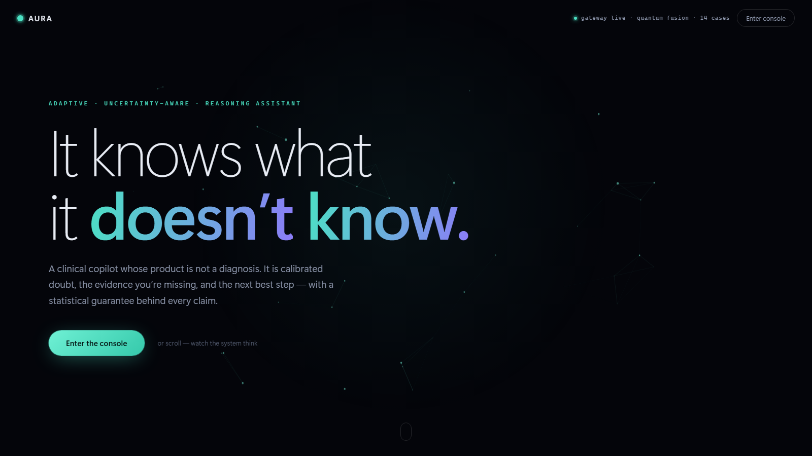
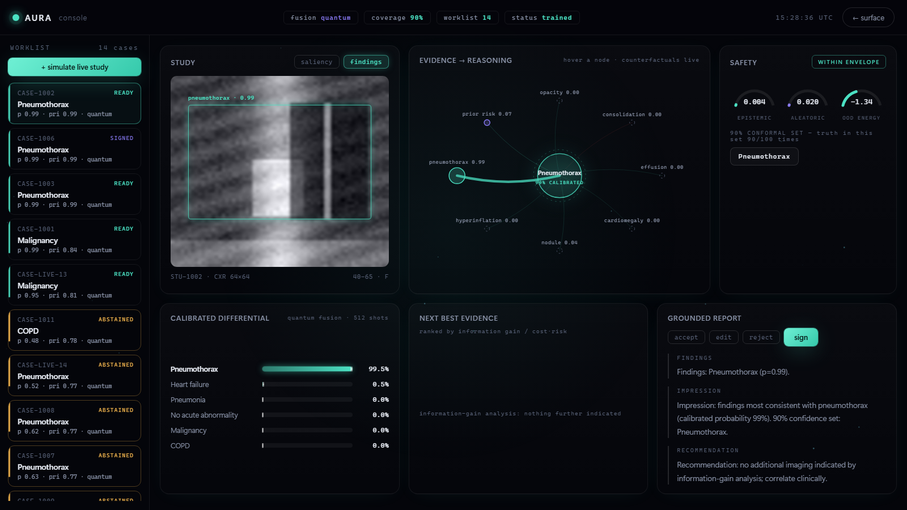

<div align="center">

# AURA

### The clinical copilot that knows what it doesn't know.

Most medical AI gives you a diagnosis. AURA's product is **calibrated doubt** — how sure it is,
what evidence is missing, which test to run next, and the license to say *"I don't know"*
instead of failing silently. Fully offline. No cloud, no API keys, no PHI leaving the box.



</div>

## Run it in 60 seconds

```bash
git clone https://github.com/Sivaguru-2008/aura
cd aura/aura
py -m pip install -r requirements.txt     # Windows: py | macOS/Linux: python3
py -m aura_cli serve
```

Open **http://localhost:8000** — trained models ship in `aura/artifacts/`, so it works
immediately. (Retrain from scratch anytime with `py -m aura_cli train` — ~30 s on a laptop CPU.)

## What's actually real here

- **Quantum evidence fusion** — an 8-qubit variational circuit (PennyLane) angle-encodes the
  evidence vector; entangling layers capture higher-order interactions. A classical Bayesian
  product-of-experts twin trains beside it, and a built-in benchmark compares them head-to-head:

  | metric (held-out) | quantum | classical | better |
  |---|---|---|---|
  | accuracy | **0.96** | 0.93 | higher |
  | ECE (calibration) | **0.020** | 0.276 | lower |
  | NLL | **0.093** | 0.488 | lower |
  | Brier | **0.060** | 0.204 | lower |

  When AURA says 96%, it means 96% — the quantum posterior is **13.8× better calibrated**.

- **Safety that refuses to guess** — deep-ensemble epistemic variance, temperature scaling,
  **conformal prediction sets with a 90% coverage guarantee**, energy-score OOD detection, and
  an explicit abstention policy. Uncertain cases escalate to a human carrying their full
  uncertainty report.
- **Missing-evidence engine** — ranks the next diagnostic step by expected information gain
  per unit cost and risk.
- **Explainability everywhere** — occlusion saliency over the image, Shapley-style attribution
  and live counterfactuals over every evidence node.
- **Grounded reports** — every sentence traces to the evidence nodes that produced it; the
  clinician's accept/edit/reject verdicts feed a learning loop with a full audit trail.

## The console

Entering `/app` isn't navigation — the interface collapses into a particle core, the engines
report in over the live gateway, and the clinical console assembles itself. Inside, everything
breathes: evidence converges into reasoning, charts spring, reports write themselves.



## Architecture

```
study → vision → evidence encoding → quantum fusion → safety (conformal · OOD · abstention)
      → explainability → missing-evidence recommender → grounded report → clinician feedback
```

Each engine is an independently replaceable package under [`aura/services/`](aura/services),
speaking shared Pydantic contracts ([`aura/schemas/`](aura/schemas)) over an event bus — the
FastAPI gateway ([`aura/gateway/`](aura/gateway)) orchestrates and persists. The zero-dependency
web experience lives in [`aura/apps/web/`](aura/apps/web). Deep dive:
[`aura/docs/ARCHITECTURE.md`](aura/docs/ARCHITECTURE.md).

<div align="center">
<sub>Built for the judges who ask "but is it calibrated?"</sub>
</div>
