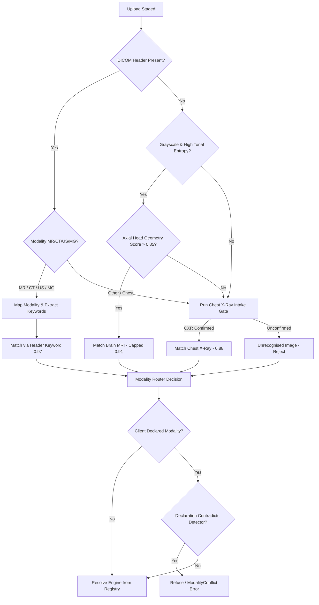
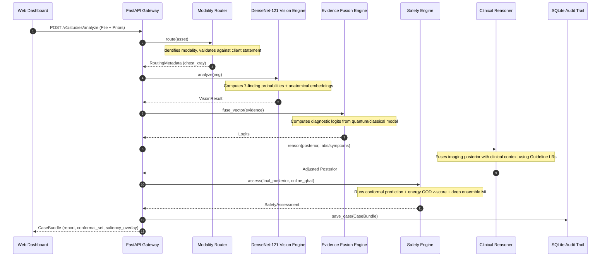
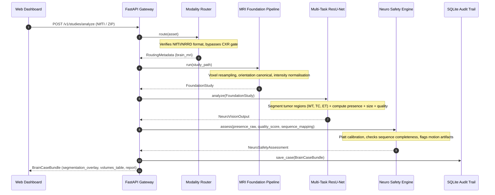
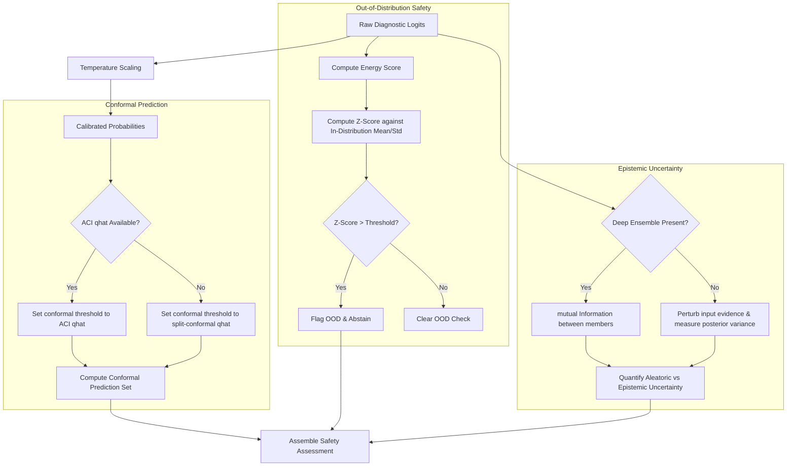
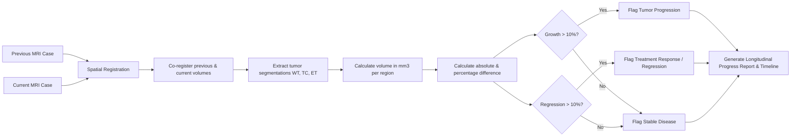

# AURA System Architecture and Design Diagrams

This document details the software architecture, pipeline flow, and safety mechanisms of the AURA Clinical Intelligence Copilot.

---

## 1. Overall System Architecture

```mermaid
graph TD
    Client[Client / Web SPA] -->|POST /analyze| Gateway[FastAPI Gateway]
    Client -->|HTTP GET/POST| Auth[OIDC/RBAC Gateway Security]
    
    Gateway -->|1. Stream & Hash| Intake[Upload Intake]
    Intake -->|ImageAsset| Router[Intelligent Modality Router]
    
    Router -->|Support Check| Registry[Engine Registry]
    Router -->|Select Engine| Dispatch[Dispatch Service]
    
    subgraph Thorax Engine (Chest X-Ray)
        Dispatch -->|Route: chest_xray| Thorax[Thorax Engine Adapter]
        Thorax -->|224x224 Grid| DenseNet[DenseNet-121 Feature Extractor]
        DenseNet -->|Logits| tempScaleC[Temperature Scaling]
        tempScaleC -->|Calibrated Logits| Fusion[Evidence Fusion Backend]
        Fusion -->|Adjusted Posterior| Reasoner[Clinical Reasoner]
        Reasoner -->|multimodal Posterior| SafetyC[Safety Engine: Conformal + OOD]
        SafetyC -->|Assess| Explain[Saliency Explainer]
        Explain -->|Grounded| ReportC[Grounded Report Engine]
    end
    
    subgraph NeuroMind Engine (Brain MRI)
        Dispatch -->|Route: brain_mri| NeuroMind[NeuroMind Engine Adapter]
        NeuroMind -->|Volumetric Series| Found[MRI Foundation Pipeline]
        Found -->|Resample + Normalise| ResUNet[Multi-Task ResU-Net]
        ResUNet -->|Segmentation Mask| SliceProj[2D Visual Slice Projector]
        ResUNet -->|Tumour Presence| tempScaleB[Platt Calibration]
        ResUNet -->|Quality & Size| SafetyB[Neuro Safety Engine]
        tempScaleB -->|Calibrated Prob| SafetyB
        SafetyB -->|Report Grounding| ReportB[Brain Report Engine]
    end
    
    ReportC -->|Save Bundle| DB[(SQLite Store & Conformal Log)]
    ReportB -->|Save Bundle| DB
    ReportC -->|Embeddings| Mem[(Memory Similar Index)]
    
    DB -->|Audit Rows| Admin[Admin Monitoring Dashboard]
```

---

## 2. Modality Routing and Decision Flow



---

## 3. Thorax Diagnostic Pipeline



---

## 4. NeuroMind Diagnostic Pipeline



---

## 5. Safety Engine Guardrails



---

## 6. Longitudinal Progression and Tracking


