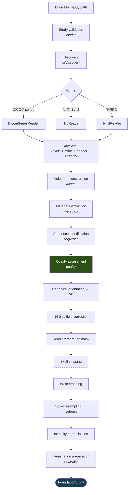
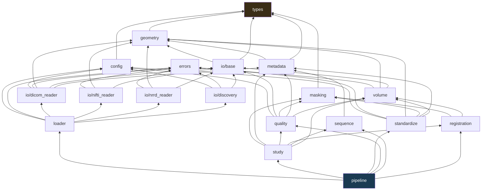
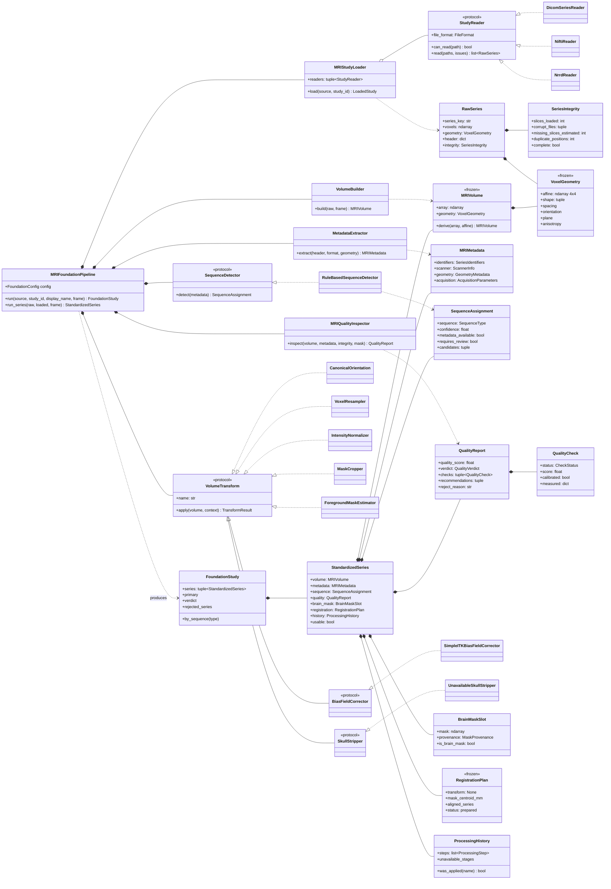

# AURA NeuroMind — MRI Foundation Layer

Raw brain MRI in, standardised model-ready study out. No models, no segmentation, no
clinical interpretation. This layer's entire job is to make sure that whatever runs
next is looking at a volume it can trust — and knows exactly what was done to it.

```python
from backend.foundation.mri import MRIFoundationPipeline, SequenceType

study = MRIFoundationPipeline().run("/data/studies/patient-004")

t1 = study.first(SequenceType.T1)
if t1 and t1.usable:
    array  = t1.volume.array      # canonical RAS, 1 mm isotropic, z-scored
    affine = t1.volume.affine     # world coordinates preserved end to end
    assert t1.history.was_applied("voxel_resampling")
    assert not t1.brain_mask.is_brain_mask     # it is a head mask, and says so
```

---

## 1. Where it lives

```
aura/backend/
├── core/                     UNCHANGED — the Intelligent Router
├── engines/
│   ├── thorax/               UNCHANGED — the chest-X-ray engine
│   └── neuro/engine.py       preprocess() now runs the foundation layer
└── foundation/               ← NEW
    └── mri/
        ├── types.py          vocabulary: sequences, formats, statuses, provenance
        ├── errors.py         error taxonomy, extends AuraBackendError
        ├── config.py         injectable frozen configuration
        ├── geometry.py       affines, orientation codes, canonical reorientation
        ├── io/
        │   ├── base.py       RawSeries, SeriesIntegrity, StudyReader protocol
        │   ├── dicom_reader.py    pydicom; series grouping, sorting, gap detection
        │   ├── nifti_reader.py    NIfTI-1 and NIfTI-2, written to the spec
        │   ├── nrrd_reader.py     NRRD, written to the spec
        │   └── discovery.py       bounded directory scan, reader ownership
        ├── loader.py         (1) MRI Study Loader
        ├── metadata.py       (2) MRI Metadata Engine
        ├── sequence.py       (3) MRI Sequence Detector
        ├── quality.py        (4) MRI Quality Inspector
        ├── volume.py         (5) MRI Volume Builder
        ├── standardize.py    (6) MRI Standardisation
        ├── masking.py            brain-mask slot + head/foreground estimator
        ├── registration.py       registration preparation (no transform)
        ├── study.py          (7) Foundation Data Model
        └── pipeline.py           the composition root
```

Nothing outside `foundation/` changed except `engines/neuro/engine.py`, which is the
one file the specification asked to integrate with. The router and the Thorax engine
are untouched.

---

## 2. Processing pipeline



Dashed stages are **interface-only** in this deployment — see §6. Quality control is
highlighted because *where* it sits is a design decision, not an ordering accident.

### Why quality control runs before standardisation

Resampling, cropping, and normalisation change every intensity statistic the inspector
measures. A z-scored volume has an SNR that describes the normalisation rather than the
acquisition; a cropped volume has no air left to estimate noise from at all. Inspecting
afterwards would produce a report about the pipeline instead of about the scan.

### Why the standardisation stages are in that order

| # | Stage | Why here |
|---|---|---|
| 1 | Canonical orientation | Free (a permutation), and every later stage is easier to reason about on a known axis convention. |
| 2 | Bias field correction | Before anything that measures intensity — the field it removes corrupts every intensity statistic. |
| 3 | Foreground mask | Cropping and normalisation must share one mask. |
| 4 | Skull stripping | After a mask exists, so a real stripper can refine it. |
| 5 | Brain cropping | Before resampling: resampling then runs over a much smaller array. |
| 6 | Voxel resampling | Before normalisation, so the statistics describe the grid the model sees. |
| 7 | Intensity normalisation | Last. |

---

## 3. Module dependency graph

Generated from the actual imports, not from intent. It is acyclic and strictly layered.



Three properties worth noting:

* **`types` and `errors` are leaves.** Nothing in the vocabulary imports anything, so a
  downstream model can `from backend.foundation.mri.types import SequenceType` to
  declare what it accepts without dragging in a reader.
* **Readers depend on `io/base`, never on each other.** Adding a fourth format touches
  one new file and one line in `MRIStudyLoader`'s default reader tuple.
* **`pipeline` is the only module that knows about all the others.** It is a
  composition root and holds no logic of its own beyond ordering and error policy.

---

## 4. Architecture (UML)



---

## 5. The modules

### 5.1 MRI Study Loader — `loader.py`, `io/`

Reads DICOM series, NIfTI-1/2, and NRRD. **No third-party imaging dependency for two
of the three**: nibabel and pynrrd are not installed in this deployment, so the NIfTI
and NRRD readers are written directly against the published header layouts. A
foundation layer that could not read the format the entire neuroimaging world exchanges
data in would not be a foundation layer. Both are covered by write-then-read round-trip
tests asserting that world coordinates survive.

| Format | Supported | Declined, by name |
|---|---|---|
| DICOM | Classic single-frame series; Enhanced multi-frame; `RescaleSlope`/`Intercept` | — |
| NIfTI | NIfTI-1 and -2, `.nii`, `.nii.gz`, `.hdr`/`.img` pairs, both byte orders, all real scalar types, `scl_slope`/`scl_inter`, sform→qform→pixdim precedence, 3D and 4D | complex, RGB, ≥5D |
| NRRD | `raw` / `gzip` / `ascii`, attached and detached payloads, both byte orders, LPS and RAS spaces, `line skip` / `byte skip` | `bzip2`, block types, multi-file `LIST` |

**Grouping is not by `SeriesInstanceUID` alone.** Real exports routinely put several
distinct volumes under one series UID, and stacking them produces an array with
interleaved contrasts that looks entirely plausible. The composite key also splits on
echo number, image orientation, matrix size, and magnitude/phase/real/imaginary — the
same splits `dcm2niix` makes, for the same reasons.

**Sorting is by projection of `ImagePositionPatient` onto the slice normal**, not by
`InstanceNumber`. Instance numbers are reliable until they are not (reordered exports,
interleaved acquisitions, PACS renumbering); a position projection is geometry, and
geometry cannot be renumbered.

**Missing slices are inferred from the sorted positions**: a gap that is a clean
multiple of the series' own median spacing is a dropped slice, and the multiple says how
many. This is the only point in the pipeline where that evidence still exists — once
the array is stacked, a missing slice and a thicker slice are the same thing.

`MONOCHROME1` is **not** inverted. Inversion is a display transform; applying it here
would corrupt every quantitative measurement downstream. The photometric interpretation
is recorded and the quality inspector warns.

### 5.2 MRI Metadata Engine — `metadata.py`

Typed pydantic models: `SeriesIdentifiers`, `ScannerInfo`, `GeometryMetadata`,
`AcquisitionParameters`.

**Patient-independent by construction, not by convention.** Extraction works from an
*allowlist* (`DICOM_KEYWORDS`) rather than by copying a dataset and deleting the
sensitive parts. A denylist is one new DICOM keyword away from leaking; an allowlist
fails closed. Dates are excluded alongside names and identifiers — study and birth dates
are identifiers under HIPAA Safe Harbor, and nothing here needs them.
`assert_patient_independent()` re-checks the finished model, and a unit test runs it
against a synthetic study stuffed with every identifier.

**Absent is never zero.** Every field is `Optional` and defaults to `None`. A missing
`EchoTime` must not arrive downstream as `0.0`: the sequence detector treats "TE
unknown" and "TE = 0 ms" completely differently, and only one of them is true.

Recorded geometry and geometry derived from the affine are **both** kept. When they
disagree that is itself the finding — a `SliceThickness` of 1 mm alongside a derived
3 mm slice spacing means a gapped acquisition, and a volume measurement made without
knowing that is wrong by exactly that ratio.

### 5.3 MRI Sequence Detector — `sequence.py`

T1 · T1ce · T2 · FLAIR · DWI · ADC · SWI · PD · Unknown.

Evidence in strict precedence order:

1. **Acquisition parameters** — `ScanningSequence`, `SequenceVariant`, TR, TE, TI, flip
   angle, `ImageType`, diffusion b-value. Written by the pulse program. This is physics.
2. **Contrast administration** — upgrades T1 to T1ce.
3. **Free text** — `SeriesDescription`, `ProtocolName`, filename. Used only to break
   ties among candidates the parameters already support, or as a last resort when there
   are no parameters at all (every NIfTI, most NRRD).

> *"Never depend on filenames alone"* is enforced **structurally**, not by convention.
> Description evidence enters through a separate scoring channel capped at
> `DESCRIPTION_ONLY_CAP = 0.55` and always emitted with `metadata_available=False`,
> `source="description_only"`, and `requires_review=True`. A description-only answer
> cannot reach the confidence of a parameter-derived one, so a caller thresholding on
> confidence gets the right behaviour without knowing this module's internals.

Two rules exist specifically to prevent contrast errors that are otherwise silent:

* **ADC is checked before DWI.** ADC is a computed map, not an acquisition, and the two
  are visually inverted — a stroke model reads restricted diffusion as facilitated if
  they are confused.
* **A short-TI inversion recovery is not called FLAIR.** STIR nulls fat, not CSF. It
  falls outside the classes this detector names, and saying so beats mislabelling it.

Thresholds are the conventional brain-MRI values at 1.5–3 T (Bitar et al.,
*RadioGraphics* 2006; Bernstein et al., *Handbook of MRI Pulse Sequences*, 2004) and are
named constants a reviewer can check.

A learned classifier is the obvious upgrade and drops in behind the `SequenceDetector`
protocol. It is not what this layer ships, because training one honestly needs a
labelled multi-vendor corpus this deployment does not have.

### 5.4 MRI Quality Inspector — `quality.py`

Seven checks. Every number is measured from the data.

| Check | Calibrated | Measures |
|---|---|---|
| `slice_completeness` | ✅ | Missing/corrupt/duplicate slices, spacing regularity |
| `orientation` | ✅ | Affine singularity, indeterminate axes, unknown world orientation, obliquity |
| `resolution` | ✅ | Voxel size bounds, slice thickness, anisotropy |
| `field_of_view` | ✅ | Head extent plausibility per axis |
| `intensity` | ✅ | NaN/Inf, constant volumes, saturation, negatives, distinct-value ratio |
| `noise` | ❌ **provisional** | NEMA two-region SNR, Rayleigh-corrected |
| `motion` | ❌ **provisional** | Adjacent-slice correlation, phase-encode ghost ratio, edge energy |

**The calibration split is enforced in code, not by discipline.** `_check()` clamps any
check constructed with `calibrated=False` from `FAIL` to `WARN`, so an uncalibrated
threshold has no reject authority and a *new* uncalibrated check cannot accidentally
gain it. That is the same posture the modality router takes with its uncalibrated
pixel-only path, and for the same reason: a number nobody validated must not be able to
look like a number somebody did.

Motion and SNR thresholds were **not** fitted on a labelled corpus here, because none
was available. The measurements are real; the thresholds are provisional and labelled.

`NOT_EVALUATED` is a first-class outcome and is **excluded from the score** rather than
scored zero or one. Scoring it zero would punish a study for a check that could not run;
scoring it one would let an unevaluated check raise the score.

Method notes:

* **SNR** — magnitude MR background is Rayleigh-distributed, whose standard deviation is
  `0.655·σ` of the underlying Gaussian noise. The estimator divides the measured
  background standard deviation by that factor and forms `mean(foreground)/σ`. It needs
  air in the field of view, so on a cropped or skull-stripped volume it reports
  `NOT_EVALUATED` rather than returning a meaningless number.
* **Motion** — two physical proxies. Adjacent slices through a head correlate strongly
  because anatomy changes slowly through-plane, so a correlation drop marks inter-slice
  displacement. And ghosts replicate the object along the **phase-encode** direction
  only, so structured signal in the phase-encode-aligned air bands relative to the
  frequency-encode bands is the ghosting signature — the same measurement ACR phantom QA
  uses. The phase-encode direction is read from `InPlanePhaseEncodingDirection`; without
  it, the metric is reported with `direction: unknown` so nobody reads it as a
  phase-encode measurement.

The report carries a score, a verdict, per-check measurements, warnings,
**recommendations** (each one actionable), and a `reject_reason` when rejected.

### 5.5 MRI Volume Builder — `volume.py`

`MRIVolume` is frozen and holds the array *and* its `VoxelGeometry`. There is no
supported way to get one without the other, and every transform returns a new one via
`derive()`.

That is the whole design. Nearly every bug this layer could plausibly ship is a bug
where voxels were changed and the affine was not — a volume reoriented without its
affine looks perfectly normal and is left–right mirrored. Making them one value removes
the class of error instead of testing for it.

Minimum slice count is enforced here rather than in each reader, because it is a
property of *being a volume*, not of any storage format: a one-slice NIfTI has exactly
the same problem as a one-slice DICOM series.

4D series (multi-b-value DWI, dynamics) are kept 4D by the readers so the builder has to
make an **explicit, recorded** choice about which frame to use, rather than silently
collapsing one.

### 5.6 MRI Standardisation — `standardize.py`

Every stage implements `VolumeTransform`: volume in, volume out, plus the parameters it
used. The pipeline composes them and records each in the processing history.

The specification asked for *interfaces only* here. That is the right call for two of
the five stages and the wrong call for the other three, so the split is drawn on a
principle rather than uniformly:

**Implemented** — `CanonicalOrientation`, `VoxelResampler`, `IntensityNormalizer`,
`MaskCropper`. Deterministic geometry and arithmetic: no model, no tuning, no ambiguity.
Reorientation is an axis permutation; resampling is interpolation on a known grid;
z-scoring is a mean and a standard deviation. The pipeline the specification describes
(*"Orientation Standardization … Intensity Normalization … Voxel Resampling"*) cannot
produce standardised output without them, and stubbing them would mean shipping a
pipeline that does not standardise anything.

**Interface-only** — `BiasFieldCorrector` and `SkullStripper`. Genuinely different. N4 is
an iterative B-spline field fit that belongs to ITK; every credible skull stripper is a
learned model (HD-BET, SynthStrip) or an external toolkit (FSL BET, ANTs) — both
explicitly out of scope. Rather than a stub that pretends, each ships a real interface
plus a concrete adapter that raises `StageUnavailable` with a specific reason:

```
n4_bias_field_correction   unavailable
  "N4 bias-field correction requires SimpleITK, which is not installed in this
   deployment. The volume is NOT bias corrected; low-frequency intensity
   inhomogeneity remains and will bias any intensity-based segmentation or volumetry."
```

Installing SimpleITK turns `SimpleITKBiasFieldCorrector` on with no other change.

> The honest failure mode is a volume that says *"not bias corrected"*. The dangerous
> one is a volume that says nothing and is assumed corrected.

Notes on the implemented stages:

* Trilinear (`order=1`) is the resampling default rather than cubic. Cubic overshoots at
  tissue boundaries and produces intensities that were never acquired, which then look
  like signal to whatever runs next.
* Masks are resampled **nearest-neighbour** alongside the volume. A mask is a label map,
  and interpolating one produces fractional membership that is not a mask at all.
* Normalisation statistics are computed over mask voxels. Including air would let the
  ratio of head to background — a function of field of view, not anatomy — move the mean
  and standard deviation of every volume.
* Non-finite voxels stay non-finite through normalisation. The intensity check already
  measured them; replacing them here would erase that evidence.

### 5.7 Foundation Data Model — `study.py`

`StandardizedSeries` is the single object the specification asks for:

| Requirement | Field |
|---|---|
| Volume | `.volume` (`MRIVolume`) |
| Metadata | `.metadata` (`MRIMetadata`) |
| Quality Report | `.quality` (`QualityReport`) |
| Orientation | `.orientation` → `"RAS"` |
| Spacing | `.spacing` → `(1.0, 1.0, 1.0)` |
| Brain Mask placeholder | `.brain_mask` (`BrainMaskSlot`) |
| Registration placeholder | `.registration` (`RegistrationPlan`) |
| Processing History | `.history` (`ProcessingHistory`) |

`FoundationStudy` is the container, because a brain MRI study is *several* of those —
T1, T2, FLAIR, DWI — and a sequence-fusing model needs them together with the
study-level findings that only exist across series. It offers `by_sequence()`,
`first()`, `primary`, `sequences_present`, `usable_series`, and `rejected_series`.

**The processing history is not optional.** Two volumes that look identical can have had
completely different things done to them, and the difference decides whether a model's
output means anything. `history.was_applied("n4_bias_field_correction")` is the query a
downstream module should use — not an assumption drawn from how the pipeline was
configured that week.

Step statuses distinguish `applied` · `no_op` · `skipped` · `unavailable` · `failed`.
"Ran and found nothing to do", "was turned off", and "has no backend here" are three
different facts and an audit must not see them as one.

### 5.8 Masking — `masking.py`

A threshold-and-largest-component mask captures the **head**: brain, CSF, skull, scalp,
usually some neck. It is cheap, deterministic, robust, and genuinely useful — it drives
cropping and supplies the air region the noise estimate needs.

It is **not** a brain mask. Intracranial volume from a head mask is wrong by roughly the
volume of the skull and scalp, and nothing downstream can detect that. So
`BrainMaskSlot.is_brain_mask` is `True` only for `SKULL_STRIPPED` or `EXTERNAL`
provenance, and the default foundation output reports
`provenance: foreground_heuristic, is_brain_mask: false`.

### 5.9 Registration preparation — `registration.py`

Registration is out of scope. Preparing for it is not: target space, the moving image's
geometry, the mask centroid a rigid initialisation starts from, and which series share a
`FrameOfReferenceUID` and are therefore *already* co-registered — re-registering those
can introduce error rather than remove it.

`RegistrationPlan.transform` is `None` and stays `None`. It is typed as a placeholder
rather than pre-filled with identity on purpose: an identity transform is a **claim**
that the volumes are aligned, and a module that applied it would silently assume a
registration that never happened.

---

## 6. Configuration

Frozen dataclasses, constructed by the caller and injected. No module-level mutable
state, no `os.environ` read at import, no path baked into any default — two pipelines
with different thresholds run in the same process without disturbing each other.

```python
from backend.foundation.mri import FoundationConfig, StandardizationConfig
from backend.foundation.mri.types import NormalizationMethod

config = FoundationConfig(
    standardization=StandardizationConfig(
        target_spacing_mm=(2.0, 2.0, 2.0),
        normalization=NormalizationMethod.PERCENTILE,
        crop_to_mask=False,
        strict=True,          # an unavailable stage becomes fatal
    ),
    reject_on_quality=True,
)
pipeline = MRIFoundationPipeline(config)
```

Every component is injectable:

```python
MRIFoundationPipeline(
    loader=MRIStudyLoader(readers=[MyPacsReader(), NiftiReader()]),
    sequence_detector=MyLearnedSequenceClassifier(),
    stages=[CanonicalOrientation(), MyN4(), VoxelResampler((1., 1., 1.))],
)
```

Thresholds are split into two groups, and the split drives the `calibrated` flag in the
report: **physical bounds** (voxel size, head field of view) come from physics and
anatomy; **artefact thresholds** (motion, SNR) are provisional.

---

## 7. Error taxonomy

Every failure extends `AuraBackendError`, so the API renders foundation failures exactly
like routing failures.

| Code | HTTP | Meaning |
|---|---|---|
| `study_not_found` | 404 | Path absent, or holds no candidate files |
| `unsupported_study_format` | 415 | Files found, no reader claimed any |
| `corrupt_study` | 422 | Format identified, content contradicted it |
| `study_validation_failed` | 422 | Decoded but cannot form a volume |
| `study_rejected_by_quality_control` | 422 | Measured and refused (opt-in) |
| `standardisation_stage_unavailable` | 501 | Declared stage, no backend here |
| `standardisation_stage_failed` | 500 | Available stage ran and broke |

Failure policy is **per series**, so one bad series never costs a study. Only when every
series fails does the study raise. `detail` carries client-safe structured context;
filesystem paths are logged, never returned.

---

## 8. Integration with NeuroMind

`engines/neuro/engine.py` is the one file outside `foundation/` that changed.

| Stage | Before | Now |
|---|---|---|
| `validate_input` | Pixel fingerprint: decodable + grayscale + MR header | Asks the foundation readers what they claim; rejects 2D exports by name |
| `preprocess` | `load_cxr` → resize to 224² → percentile clip | Full foundation pipeline → `FoundationStudy` |
| `analyze` | `EngineNotImplemented` | `EngineNotImplemented`, now carrying the foundation description |
| `generate_report` | `EngineNotImplemented` | unchanged |

**Analysis is still not implemented, and still refuses.** That has not changed and must
not: a clinical payload that *looks* like a result but is grounded in no model is
exactly the failure the rest of AURA's safety machinery exists to prevent. What changed
is that the refusal now arrives with real, measured preprocessing evidence attached.

Verified against the real Enhanced MR DICOM bundled with pydicom:

```
STATUS: not_implemented
format: dicom | series: 1 | sequences: ['t1'] | verdict: acceptable_with_warnings
shape [64, 64, 10]  spacing [1.0, 1.0, 1.0]  orientation RAS   (source was LPS)
quality 0.8658
warnings: 'the field of view spans only 10 mm along axis 2 … consistent with a
           targeted slab rather than a whole-brain acquisition'
          'estimated SNR is 3.1, below the conventional diagnostic floor of 10'
mask: foreground_heuristic   is_brain_mask False
registration transform: None
history: volume_reconstruction:applied  metadata_extraction:applied
         sequence_identification:applied  quality_assessment:applied
         canonical_orientation:applied   n4_bias_field_correction:UNAVAILABLE
         foreground_mask:applied         skull_stripping:UNAVAILABLE
         brain_cropping:no_op            voxel_resampling:no_op
         intensity_normalization:applied registration_preparation:applied
```

**A 2D PNG export is now rejected at `validate_input`.** It has no voxel spacing, no
slice positions, and no world orientation; there is no honest way to build a volume from
it. The previous placeholder accepted one and resized it to a square array, which looked
like preprocessing and was not.

**One boundary remains open.** The routing layer's `ImageAsset` is a *single staged
file*, because that is what an HTTP upload is; the foundation layer's natural input is a
*study directory*. `preprocess` bridges them by handing the pipeline the single staged
file, which it reads as a one-series study. Multi-file study upload (a zip, or a
multipart study endpoint) is the next piece of intake work and belongs in `core/upload`,
not in the engine.

---

## 9. Tests

```bash
python -m pytest tests/test_mri_foundation.py -q
```

**109 tests, all passing.** Full repository suite: **263 passed, 1 skipped, 0 failed**.

Four layers: geometry (world-coordinate invariance under every transform) · readers
(write a real file in each format, read it back, assert the round trip; failure paths
tested with deliberately damaged files) · components in isolation · pipeline end to end
over synthetic DICOM and NIfTI studies.

Synthetic files are legitimate here in a way they are not for the modality router: a
NIfTI header written to the published spec **is** a real NIfTI header, whereas a
synthetic chest film is not a real acquisition. The DICOM fixtures are written with
pydicom and are genuinely readable studies, parameterised so that missing slices,
duplicated positions, multi-echo interleaving, and truncated pixel data are produced by
writing actually-damaged series rather than by monkeypatching the reader.

Two tests guard the layer's *honesty* rather than its correctness and should survive any
future trimming:

* `test_patient_identifiers_never_reach_metadata` — writes a study stuffed with names,
  MRNs, dates, accession numbers, institution, and physician; asserts none of it appears
  anywhere in the serialised metadata.
* `test_uncalibrated_check_cannot_reject_a_study` — asserts the `FAIL`→`WARN` clamp.

---

## 10. Known limitations

1. **Motion and SNR thresholds are provisional.** No labelled motion corpus was
   available here. The measurements are real; the thresholds are not fitted. Both checks
   report `calibrated: false` and cannot reject a study. Closing this needs a labelled
   corpus, not more code.
2. **N4 bias-field correction is interface-only** without SimpleITK. Volumes are *not*
   bias corrected and the processing history says so on every study.
3. **Skull stripping is interface-only.** The mask in the foundation output is a head
   mask, labelled `foreground_heuristic`, with `is_brain_mask: false`. Do not use it for
   volumetry.
4. **Sequence detection is rule-based.** It is metadata-first and honest about its
   confidence, but a NIfTI with no acquisition parameters can only ever be classified
   from free text, capped at 0.55 and flagged for review. A learned classifier behind
   the `SequenceDetector` protocol is the upgrade.
5. **Registration is not implemented** — only prepared. `transform` is `None`.
6. **Single-file upload only through the engine.** See §8.
7. **Oblique acquisitions keep their obliquity.** `to_canonical` is an axis permutation;
   removing residual obliquity requires resampling, which is a separate stage with a
   separate cost. The angle is measured and reported.
8. **NRRD space defaults to LPS** when the header omits or genericises the `space`
   field. That matches ITK and 3D Slicer defaults and covers the overwhelming majority
   of real medical NRRD, but it is an assumption and it is recorded in the warnings.

---

## 11. Extending

**A fourth format**: implement `StudyReader` (`can_read`, `read`), add it to the loader's
reader tuple. Nothing else changes.

**A learned sequence classifier**: implement `SequenceDetector.detect`, pass it to the
pipeline constructor. Return `metadata_available=True` only when it genuinely used
acquisition parameters.

**A real skull stripper**: implement `SkullStripper.apply`, fill `context.mask` with
`MaskProvenance.SKULL_STRIPPED`, and pass it in `stages`. `is_brain_mask` becomes `True`
and every downstream consumer that checks it starts trusting the mask.

**N4**: `pip install SimpleITK`. `SimpleITKBiasFieldCorrector` constructs, the stage
runs, and the history records `applied` instead of `unavailable`.

**A NeuroMind model**: consume `FoundationStudy`. Ask for the contrast you need by name
(`study.first(SequenceType.FLAIR)`), check `.usable`, check
`history.was_applied(...)` for any preprocessing your model assumes, and check
`brain_mask.is_brain_mask` before using the mask for anything quantitative.
